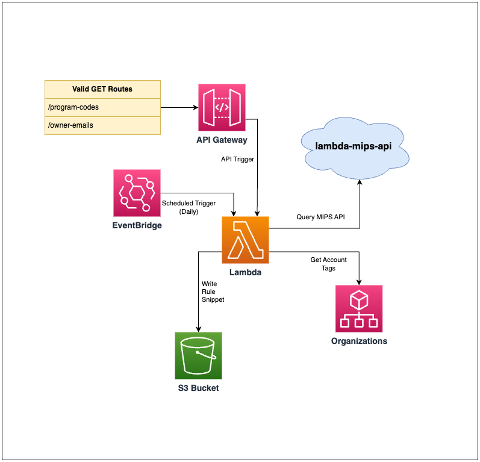

# lambda-finops-cost-rules
A lambda for generating the JSON string used by the Rules property of an
AWS::CE::CostCategory CloudFormation resource.

## Design
This lambda is intended to transform the chart of accounts returned from
[lambda-mips-api](https://github.com/Sage-Bionetworks-IT/lambda-mips-api),
combined with current AWS account tags, into cost-category rules (JSON string)
appropriate to pass to the [`Rules` property for `AWS::CE::CostCategory`](https://docs.aws.amazon.com/AWSCloudFormation/latest/UserGuide/aws-resource-ce-costcategory.html#cfn-ce-costcategory-rules).

This lambda will query `lambda-mips-api` for a chart of accounts (a mapping of
program codes and program names), and query AWS Organizations for account-level
cost-tracking tags.

Cost categories are created for each program listed in the chart of accounts.

Tags may exist on either individual cloud resources or on their containing
accounts which assign the resource costs to a particular program category.
A list of tag names that may contain program assignments are provided as a
template parameter.

### Category Rules

Cost-category rules are created to assign line item costs to a category based on
tags for the line item resource or its containing account.

First, this lambda will create cost-category rules that check a list of tags
(provided as a template parameter) for every combination of program code and
tag name, also create rules for each account with an appropriate tag, and
finally create rules to inherit the value from a listed tag if no other rule
matches.

The order of the rules matters because processing will stop at the first match.
For more information on rule processing, see the [AWS User Guide](https://docs.aws.amazon.com/awsaccountbilling/latest/aboutv2/manage-cost-categories.html).

### Components


### Template Parameters
The following template parameters are used to configure Cloudformation resources
| Template Parameter | Description | Example Value |
| --- | --- | --- |
| DnsName | Custom host name to use for API Gateway | cost-rules.example.com |
| AcmCertificateArn | AWS ARN of an ACM certificate valid for `DnsName` | arn:aws:acm:us-east-1:&lt;ACCOUNT ID>:certificate/&lt;CERTIFICATE UUID> |

The following template parameters are passed through as environment variables
| Template Parameter | Environment Variable | Description | Example Value |
| --- | --- | --- | --- |
| ChartOfAccountsURL | ChartOfAccountsURL | URL to the chart of accounts endpoint provided by `lambda-mips-api` | https://lambda-mips-api.execute-api.amazonaws.com/accounts |
| ProgramCodeTagList | ProgramCodeTagList | Comma-separated list of tag names that may contain program-code assignment | CostCenter,CostCenterOther |

### Triggering
The CloudFormation template will output the available endpoint URL for triggering the lambda, e.g.:
`https://abcxyz.execute-api.amazonaws.com/rules`

These URLs can be also constructed by appending the API Gateway paths to the CloudFormation domain.

### Response
This lambda will produce the example output when provided with the example external state and default parameters:

#### Example External State
The lambda queries two remote sources for their current state: the current chart of accounts from `lambda-mips-api` and current account tags from AWS Organizations.

Example chart of accounts returned by `lambda-mips-api` at `ChartOfAccountsURL`:
```json
[
    "000000": "No Program / 000000",
    "000001": "Other",
    "123456": "Program Part A",
    "654321": "Other Program"
]
```

Example existing AWS account tags:
| Account ID | Tag value from a tag listed in `TagList` |
| --- | --- |
| 111122223333 | `Program Part A / 123456` |
| 222233334444 | `Program Part B / 123456` |
| 333344445555 | `Other Program / 654321` |


#### Example Output
A JSON string to be passed to a Rules property of an AWS::CE::CostCategory resource:
```json
[
    {
        "Type": "REGULAR",
        "Value": "123456 Program Part A",
        "Rule": {
            "Tags": {
                "Key": "CostCenterOther",
                "Values": [ "123456" ],
                "MatchOptions": [ "ENDS_WITH" ]
            }
        }
    },
    {
        "Type": "REGULAR",
        "Value": "123456 Program Part A",
        "Rule": {
            "Tags": {
                "Key": "CostCenter",
                "Values": [ "123456" ],
                "MatchOptions": [ "ENDS_WITH" ]
            }
        }
    },
    {
        "Type": "REGULAR",
        "Value": "123456 Program Part A",
        "Rule": {
            "Dimensions": {
                "Key": "LINKED_ACCOUNT",
                "Values": [ "111122223333", "222233334444" ],
                "MatchOptions": [ "EQUALS" ]
            }
        }
    },
    {
        "Type": "REGULAR",
        "Value": "654321 Other Program",
        "Rule": {
            "Tags": {
                "Key": "CostCenterOther",
                "Values": [ "123456" ],
                "MatchOptions": [ "ENDS_WITH" ]
            }
        }
    },
    {
        "Type": "REGULAR",
        "Value": "654321 Other Program",
        "Rule": {
            "Tags": {
                "Key": "CostCenter",
                "Values": [ "123456" ],
                "MatchOptions": [ "ENDS_WITH" ]
            }
        }
    },
    {
        "Type": "REGULAR",
        "Value": "654321 Other Program",
        "Rule": {
            "Dimensions": {
                "Key": "LINKED_ACCOUNT",
                "Values": [ "333344445555" ]
                "MatchOptions": [ "EQUALS" ]
            }
        }
    },
    {
        "Type": "INHERITED_VALUE",
        "InheritedValue": {
            "DimensionName": "TAG",
            "DimensionKey": "CostCenterOther"
        }
    },
    {
        "Type": "INHERITED_VALUE",
        "InheritedValue": {
            "DimensionName": "TAG",
            "DimensionKey": "CostCenter"
        }
    }
]
```

This string can be passed to the [`Rules` property for `AWS::CE::CostCategory`](https://docs.aws.amazon.com/AWSCloudFormation/latest/UserGuide/aws-resource-ce-costcategory.html#cfn-ce-costcategory-rules).

### Example Usage (sceptre)

To use the output of this lambda in [sceptre](https://github.com/Sceptre/sceptre), use `wget` in a [`!rcmd` resolver](https://docs.sceptre-project.org/dev/docs/resolvers.html#file)

`config/dev/ce.yaml`
```yaml
template:
  path: categories.yaml
parameters:
  CostCategoryRules: !rcmd wget -qO- https://lambda-finops-cost-rules.execute-api.amazonaws.com/rules
```

`templates/categories.yaml`
```yaml
AWSTemplateFormatVersion: '2010-09-09'
Description: 'All Cost Categories'
Parameters:
  CostCategoryRules:
    Type: String
Resources:
  ProgramCodeCostCategory:
    Type: 'AWS::CE::CostCategory'
    Properties:
      Name: 'Program Code'
      RuleVersion: 'CostCategoryExpression.v1'
      Rules: !Ref CostCategoryRules
```

### Example Usage (org-formation)

To use the output of this lambda in [org-formation](https://github.com/org-formation/org-formation-cli), use `wget` in a [`!Cmd` function](https://github.com/org-formation/org-formation-cli/blob/master/docs/task-files.md#cmd)

`_tasks.yaml`
```yaml
CostCategories:
  Type: update-stacks
  Template: categories.yaml
  StackName: 'cost-categories'
  Parameters:
    CostCategoryRules: !Cmd 'wget -qO- https://lambda-finops-cost-rules.execute-api.amazonaws.com/rules'
```

`categories.yaml`
```yaml
AWSTemplateFormatVersion: '2010-09-09'
Description: 'All Cost Categories'
Parameters:
  CostCategoryRules:
    Type: String
Resources:
  ProgramCodeCostCategory:
    Type: 'AWS::CE::CostCategory'
    Properties:
      Name: 'Program Code'
      RuleVersion: 'CostCategoryExpression.v1'
      Rules: !Ref CostCategoryRules
```

## Development

### Contributions
Contributions are welcome.

### Setup Development Environment

Install the following applications:
* [AWS CLI](https://github.com/aws/aws-cli)
* [AWS SAM CLI](https://github.com/aws/aws-sam-cli)
* [pre-commit](https://github.com/pre-commit/pre-commit)
* [pipenv](https://github.com/pypa/pipenv)

Check in [.travis.yml](./.travis.yml) to see how they are installed for this
repo.

### Install Requirements
Run `pipenv install --dev` to install both production and development
requirements, and `pipenv shell` to activate the virtual environment. For more
information see the [pipenv docs](https://pipenv.pypa.io/en/latest/).

After activating the virtual environment, run `pre-commit install` to install
the [pre-commit](https://pre-commit.com/) git hook.

### Update Requirements
First, make any needed updates to the base requirements in `Pipfile`,
then use `pipenv` to regenerate both `Pipfile.lock` and
`requirements.txt`. We use `pipenv` to control versions in testing,
but `sam` relies on `requirements.txt` directly for building the
container used by the lambda.

```shell script
$ pipenv update
$ pipenv requirements > requirements.txt
```

Additionally, `pre-commit` manages its own requirements.
```shell script
$ pre-commit autoupdate
```

### Create a local build

```shell script
$ sam build
```

### Run unit tests
Tests are defined in the `tests` folder in this project. Use PIP to install the
[pytest](https://docs.pytest.org/en/latest/) and run unit tests.

```shell script
$ python -m pytest tests/ -v
```

### Run integration tests
Running integration tests
[requires docker](https://docs.aws.amazon.com/serverless-application-model/latest/developerguide/sam-cli-command-reference-sam-local-start-api.html)

```shell script
$ sam local invoke Function --event events/event.json
```

## Deployment

### Deploy Lambda to S3
Deployments are sent to the
[Sage cloudformation repository](https://bootstrap-awss3cloudformationbucket-19qromfd235z9.s3.amazonaws.com/index.html)
which requires permissions to upload to Sage
`bootstrap-awss3cloudformationbucket-19qromfd235z9` and
`essentials-awss3lambdaartifactsbucket-x29ftznj6pqw` buckets.

```shell script
sam package --template-file .aws-sam/build/template.yaml \
  --s3-bucket essentials-awss3lambdaartifactsbucket-x29ftznj6pqw \
  --output-template-file .aws-sam/build/lambda-template.yaml

aws s3 cp .aws-sam/build/lambda-template.yaml s3://bootstrap-awss3cloudformationbucket-19qromfd235z9/lambda-template/master/
```

## Publish Lambda

### Private access
Publishing the lambda makes it available in your AWS account.  It will be accessible in
the [serverless application repository](https://console.aws.amazon.com/serverlessrepo).

```shell script
sam publish --template .aws-sam/build/lambda-template.yaml
```

### Public access
Making the lambda publicly accessible makes it available in the
[global AWS serverless application repository](https://serverlessrepo.aws.amazon.com/applications)

```shell script
aws serverlessrepo put-application-policy \
  --application-id <lambda ARN> \
  --statements Principals=*,Actions=Deploy
```

## Install Lambda into AWS

### Sceptre
Create the following [sceptre](https://github.com/Sceptre/sceptre) file
config/prod/lambda-finops-cost-rules.yaml

```yaml
template:
  type: http
  url: "https://PUBLISH_BUCKET.s3.amazonaws.com/lambda-finops-cost-rules/VERSION/lambda-finops-cost-rules.yaml"
stack_name: "lambda-finops-cost-rules"
stack_tags:
  OwnerEmail: "it@sagebase.org"
parameters:
  TagList: "CostCenter,CostCenterOther"
  ChartOfAccountsURL: "https://lambda-mips-api.execute-api.amazonaws.com/accounts"
  DnsNames: "cost-rules.example.com"
  AcmCertificateArn: "arn:aws:acm:us-east-1:<ACCOUNT_ID>:certificate/<UUID>"
```

Install the lambda using sceptre:
```shell script
sceptre --var "profile=my-profile" --var "region=us-east-1" launch prod/lambda-finops-cost-rules.yaml
```

### AWS Console
Steps to deploy from AWS console.

1. Login to AWS
2. Access the
[serverless application repository](https://console.aws.amazon.com/serverlessrepo)
-> Available Applications
3. Select application to install
4. Enter Application settings
5. Click Deploy

## Releasing

We have setup our CI to automate a releases.  To kick off the process just create
a tag (i.e 0.0.1) and push to the repo.  The tag must be the same number as the current
version in [template.yaml](template.yaml).  Our CI will do the work of deploying and publishing
the lambda.
